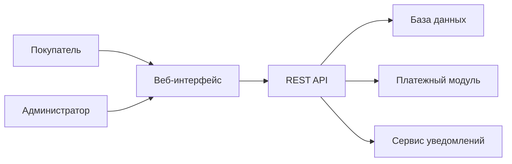

# Структура пояснительной записки

## Введение

Во введении рекомендуется раскрыть:

- актуальность темы;
- цель и задачи дипломного проекта;
- объект и предмет исследования;
- методы разработки и исследования;
- практическую значимость работы.

## Глава 1. Анализ предметной области

### 1.1 Особенности рынка спортивных товаров

Опишите специфику спортивного ассортимента: сезонность, разнообразие категорий, требования к фильтрации по бренду, размеру, назначению и цене.

### 1.2 Анализ существующих интернет-магазинов

Сравните 3-5 популярных решений по критериям:

- удобство каталога;
- поиск и фильтрация;
- скорость оформления заказа;
- наличие личного кабинета;
- качество мобильной версии;
- наличие административных инструментов.

### 1.3 Постановка задачи

Сформулируйте проблемы, которые должен решить ваш проект:

- разрозненное хранение данных о товарах;
- неудобный поиск товаров;
- отсутствие автоматизации обработки заказов;
- сложность обновления каталога;
- недостаточная информативность интерфейса для покупателя.

## Глава 2. Проектирование системы

### 2.1 Требования к системе

Соберите функциональные и нефункциональные требования, роли пользователей и сценарии использования.

### 2.2 Архитектура решения

Опишите клиент-серверную архитектуру.

Рекомендуемая схема:

### 2.3 Проектирование базы данных

Опишите сущности:

- категории;
- бренды;
- товары;
- изображения товаров;
- пользователи;
- корзины;
- заказы;
- позиции заказа;
- отзывы;
- платежи.

### 2.4 Проектирование интерфейса

Покажите структуру страниц:

- главная страница;
- каталог;
- карточка товара;
- корзина;
- оформление заказа;
- личный кабинет;
- административная панель.

## Глава 3. Реализация и тестирование

### 3.1 Выбор технологий

Пример обоснования:

- `HTML, CSS, JavaScript` для клиентской части;
- `Python/Django` или `Node.js/Express` для серверной части;
- `PostgreSQL` для хранения данных;
- `REST API` для обмена между компонентами.

### 3.2 Реализация функциональных модулей

Опишите отдельно:

- модуль каталога;
- модуль корзины;
- модуль заказов;
- модуль авторизации;
- модуль администрирования.

### 3.3 Тестирование

Рекомендуется включить:

- тесты пользовательских сценариев;
- проверку валидации форм;
- проверку расчета суммы заказа;
- проверку фильтрации каталога;
- проверку изменения статусов заказа.

### 3.4 Оценка результатов

Сделайте вывод о том, достигнута ли цель работы и какие преимущества дает разработанная система.

## Заключение

В заключении кратко отразите:

- выполненные задачи;
- полученные результаты;
- практическую ценность системы;
- направления дальнейшего развития.

## Приложения

В приложения можно вынести:

- листинги кода;
- SQL-скрипты;
- макеты интерфейсов;
- результаты тестирования;
- руководство пользователя.

## Что можно показать на защите

1. Главную страницу и каталог товаров.
2. Фильтрацию по категориям и цене.
3. Добавление товара в корзину.
4. Оформление заказа.
5. Просмотр информации о заказе.
6. Административные возможности по управлению каталогом.
